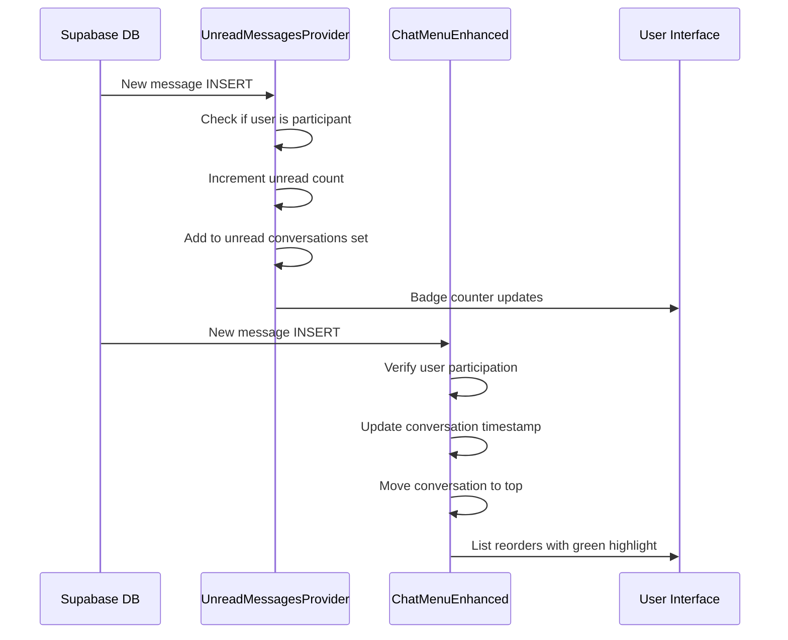

# Chat Real-Time Debugging & Improvements - November 19, 2025 (Part 3)

## Overview

Enhanced the real-time chat system with comprehensive logging and improved subscription handling to ensure:
- Badge counter updates in real-time
- Conversations jump to top when new messages arrive
- Green background highlights for unread conversations
- Proper conversation list refresh when dropdown opens

---

## Issues Addressed

### 1. **Conversation List Not Refreshing**
**Problem:** When the dropdown opened, it showed stale data and didn't reflect recent changes.

**Solution:** Added `isOpen` to the dependency array of the conversation loading effect, ensuring fresh data is loaded every time the dropdown opens.

### 2. **Message Subscription Too Broad**
**Problem:** The message subscription listened to ALL messages in the system without filtering, which could cause performance issues and unreliable updates.

**Solution:** Added explicit check to verify the user is a participant in the conversation before processing the message.

### 3. **Insufficient Logging**
**Problem:** Hard to debug real-time issues without knowing what's happening in the subscriptions.

**Solution:** Added comprehensive logging with `[ComponentName]` prefixes throughout both components.

### 4. **Duplicate State Updates**
**Problem:** The message subscription had redundant logic that could cause race conditions.

**Solution:** Streamlined the logic to update conversation list in a single operation.

---

## Changes Made

### 1. ChatMenuEnhanced.tsx

#### A. Enhanced Conversation Loading
```typescript
// NOW refreshes when dropdown opens
useEffect(() => {
  const loadAllConversations = async () => {
    if (!user?.id) return;

    console.log('[ChatMenuEnhanced] Loading conversations for user:', user.id, 'Dropdown open:', isOpen);
    
    // ... loading logic ...
  };

  loadAllConversations();
}, [user?.id, isOpen]); // ← Added isOpen dependency
```

**Impact:** Every time the user opens the chat dropdown, it fetches the latest conversation list.

#### B. Improved Message Subscription
```typescript
const messagesChannel = supabase
  .channel('chat-menu-messages')
  .on('postgres_changes', {
    event: 'INSERT',
    schema: 'public',
    table: 'messages'
  }, async (payload) => {
    const newMessage = payload.new as Message;
    console.log('[ChatMenuEnhanced] New message received:', newMessage);
    
    // ✅ NEW: Verify user is participant BEFORE processing
    const { data: conversationData } = await supabase
      .from('conversations')
      .select('*')
      .eq('id', newMessage.conversation_id)
      .single();
    
    if (!conversationData || !conversationData.participants.includes(user.id)) {
      console.log('[ChatMenuEnhanced] Message not for current user, ignoring');
      return;
    }
    
    // ✅ Process and move to top
    setAllConversations(prev => {
      // ... update logic ...
    });
  })
  .subscribe((status) => {
    console.log('[ChatMenuEnhanced] Messages channel status:', status);
  });
```

**Key Improvements:**
- Fetches conversation data to verify user participation
- Adds conversation to list if not already present
- Moves existing conversations to top
- Logs all actions for debugging

#### C. Enhanced Conversation Subscription Logging
```typescript
.subscribe((status) => {
  console.log('[ChatMenuEnhanced] Conversations channel status:', status);
});
```

**Impact:** Can now see subscription connection status in console.

---

### 2. UnreadMessagesProvider.tsx

#### A. Detailed Logging for Unread Count
```typescript
setUnreadCount(prev => {
  const newCount = prev + 1;
  console.log('[UnreadMessagesProvider] Unread count updated:', prev, '->', newCount);
  return newCount;
});

setUnreadConversations(prev => {
  const newSet = new Set(prev).add(newMessage.conversation_id);
  console.log('[UnreadMessagesProvider] Unread conversations:', Array.from(newSet));
  return newSet;
});
```

**Impact:** Can trace exactly when and how the unread count changes.

#### B. Comprehensive Message Processing Logs
```typescript
console.log('[UnreadMessagesProvider] New message received:', payload);
console.log('[UnreadMessagesProvider] User is participant, incrementing unread count');
console.log('[UnreadMessagesProvider] Unarchived conversation:', conversationData.id);
console.log('[UnreadMessagesProvider] Auto-opening chat for:', senderName);
console.log('[UnreadMessagesProvider] User is not a participant, ignoring');
```

**Impact:** Complete visibility into message processing flow.

#### C. Subscription Status Monitoring
```typescript
.subscribe((status) => {
  console.log('[UnreadMessagesProvider] Subscription status:', status);
});
```

**Impact:** Can verify subscriptions are properly connected.

---

## How Real-Time Updates Work

### Flow for New Message Reception



### Key Points

1. **Two Subscriptions:**
   - `UnreadMessagesProvider`: Manages unread count and badge
   - `ChatMenuEnhanced`: Manages conversation list order

2. **Filter Strategy:**
   - `UnreadMessagesProvider`: Filters at DB level (`sender_id=neq.${user.id}`)
   - `ChatMenuEnhanced`: Filters at application level (checks participants array)

3. **Update Triggers:**
   - Badge updates: `setUnreadCount()`
   - List reorder: `setAllConversations()`
   - Green highlight: Checks `unreadConversations.has(conversation.id)`

---

## Debugging Guide

### Check Console Logs

When a new message arrives, you should see:

```
[UnreadMessagesProvider] New message received: {...}
[UnreadMessagesProvider] User is participant, incrementing unread count
[UnreadMessagesProvider] Unread count updated: 0 -> 1
[UnreadMessagesProvider] Unread conversations: ['conv-id-123']
[UnreadMessagesProvider] Auto-opening chat for: John Doe

[ChatMenuEnhanced] New message received: {...}
[ChatMenuEnhanced] Message is for current user, updating conversations
[ChatMenuEnhanced] Moving conversation to top: conv-id-123
```

### Check Subscription Status

On component mount:

```
[ChatMenuEnhanced] Setting up real-time subscriptions for user: user-id-123
[ChatMenuEnhanced] Conversations channel status: { status: "SUBSCRIBED" }
[ChatMenuEnhanced] Messages channel status: { status: "SUBSCRIBED" }

[UnreadMessagesProvider] Subscription status: { status: "SUBSCRIBED" }
```

### Verify Dropdown Refresh

When opening the dropdown:

```
[ChatMenuEnhanced] Loading conversations for user: user-id-123 Dropdown open: true
[ChatMenuEnhanced] Loaded conversations: 5
```

---

## Testing Checklist

### Real-Time Badge Updates
- [ ] Send a message to the user from another account
- [ ] Verify console shows `[UnreadMessagesProvider] Unread count updated: 0 -> 1`
- [ ] Verify badge appears on chat icon with number "1"
- [ ] Send another message
- [ ] Verify badge updates to "2"

### Conversation List Updates
- [ ] Open chat dropdown
- [ ] Send a message from another account
- [ ] Verify console shows `[ChatMenuEnhanced] New message received:`
- [ ] Verify conversation moves to top of list
- [ ] Verify conversation has green background highlight
- [ ] Verify "New messages" text appears

### Dropdown Refresh
- [ ] Send a message while dropdown is closed
- [ ] Open dropdown
- [ ] Verify console shows `Loading conversations for user`
- [ ] Verify latest conversation appears at top

### Green Highlighting
- [ ] Conversation with unread messages should have:
  - ✅ Green left border (`border-green-500`)
  - ✅ Light green background (`bg-green-50 dark:bg-green-900/10`)
  - ✅ "New messages" text in green
- [ ] After clicking conversation, highlighting should disappear

### Subscription Health
- [ ] Check browser console on page load
- [ ] Verify all channels show `status: "SUBSCRIBED"`
- [ ] If status is "CHANNEL_ERROR", check Supabase settings

---

## Common Issues & Solutions

### Badge Not Updating

**Possible Causes:**
1. UnreadMessagesProvider subscription not connected
2. Message filter excluding the message
3. User not in participants array

**Debug:**
- Check console for `[UnreadMessagesProvider] Subscription status`
- Look for `User is not a participant, ignoring` messages
- Verify `sender_id=neq.${user.id}` filter is correct

### Conversation Not Moving to Top

**Possible Causes:**
1. ChatMenuEnhanced subscription not connected
2. Message not triggering conversation update
3. User not in participants array

**Debug:**
- Check for `[ChatMenuEnhanced] Messages channel status`
- Look for `Message not for current user, ignoring`
- Verify conversation exists in database

### Green Highlighting Not Showing

**Possible Causes:**
1. `unreadConversations` Set not updated
2. CSS classes not applied correctly
3. Dark mode vs light mode issue

**Debug:**
- Check `unreadConversations.has(conversation.id)`
- Inspect element to verify classes applied
- Test in both light and dark modes

### Dropdown Shows Stale Data

**Possible Causes:**
1. `isOpen` dependency not triggering refresh
2. Database query error
3. Network issue

**Debug:**
- Check for `Loading conversations for user: ... Dropdown open: true`
- Look for `Error loading conversations`
- Check network tab for failed requests

---

## Performance Considerations

### Optimizations Applied

1. **Debounced Search** - 300ms delay on user search
2. **Conditional Loading** - Only load when dropdown opens
3. **Single Query** - Loads all conversations in one request
4. **Filtered Subscriptions** - Only relevant messages trigger updates

### Potential Improvements

1. **Pagination** - For users with 100+ conversations
2. **Virtual Scrolling** - For better performance with many chats
3. **Caching** - Store conversation list in localStorage
4. **Batch Updates** - Group multiple updates together

---

## Files Modified

1. **src/components/chat/ChatMenuEnhanced.tsx**
   - Added `isOpen` dependency to conversation loading
   - Improved message subscription with participant verification
   - Added comprehensive logging throughout
   - Added subscription status monitoring

2. **src/contexts/UnreadMessagesProvider.tsx**
   - Enhanced logging for unread count updates
   - Added detailed message processing logs
   - Added subscription status monitoring
   - Improved error messages

---

## Success Criteria

✅ **Badge Counter** - Updates immediately when new message arrives
✅ **Conversation Order** - New messages move conversation to top
✅ **Green Highlighting** - Unread conversations clearly marked
✅ **Dropdown Refresh** - Latest data shown when opening
✅ **Debugging** - Clear logs for troubleshooting
✅ **Performance** - No unnecessary re-renders

---

## Next Steps (Optional Enhancements)

1. **Desktop Notifications** - Browser notifications for new messages
2. **Sound Alerts** - Audio notification option
3. **Read Receipts** - Show when messages are read
4. **Typing Indicators** - Show when other user is typing
5. **Message Previews** - Show last message in conversation list

---

**Implementation Date:** November 19, 2025  
**Status:** ✅ Complete and Ready for Testing  
**Related Documents:**
- CHAT_REALTIME_FIXES_NOV_19.md
- CHAT_UX_IMPROVEMENTS_NOV_19.md
- CHAT_VISUAL_IMPROVEMENTS_NOV_19.md
